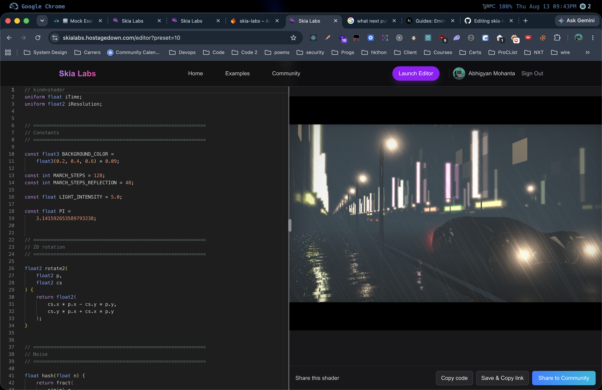
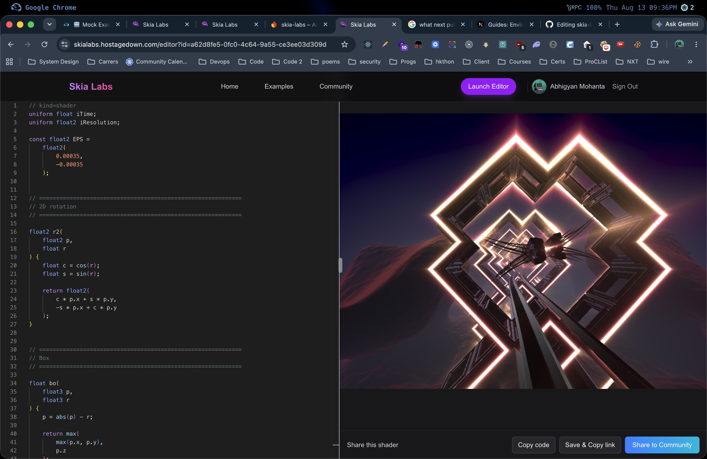

# 🌌 **Skia Labs SKSL Shader Playground**

A beautiful, fast, web-based playground for **Skia's Shader Language (SKSL)**.
Write, preview, and share shaders, all rendered with **CanvasKit (Skia WebAssembly)** and powered by **Next.js**, **Monaco Editor**, and **Firebase**.

Skia Labs makes shader experimentation feel *creative, smooth, and joyful*. ✨

<table>
  <tr>
    <td>
      
    </td>
    <td style="width: 2px; background-color: #ccc;"></td>
    <td>
      
    </td>
  </tr>
</table>

## ✨ **Features**

### 🎨 Real-time SKSL Shader Preview

* Powered by **CanvasKit WASM** for native Skia rendering.
* Instant hot-reload as you type.
* Supports animated uniforms (`iTime`, `iResolution`).

### 🌐 Firebase Community Hub

* **Social Features**: Publish your shaders directly to the community gallery, powered by Cloud Firestore.
* **Authentication**: Seamless Google Sign-in to manage your creations.
* **Interaction**: Like your favorite shaders and leave comments for authors.
* **Smart Performance**: The community feed features infinite scrolling pagination and lazy-loaded WebGL contexts to keep mobile performance buttery smooth.

### 🧠 Monaco Editor with SKSL Language Support

* Custom syntax highlighting
* Auto-closing brackets & pairs
* Dark theme
* Smooth typing performance

### 🔀 Split-View Shader Editor

* Drag-resize editor & preview
* Fully responsive and touch-friendly
* Snap-safe (min widths enforced)

### 🔗 Easy Sharing & SEO

* Save your work to the cloud and generate an instant share link
* Copy shader code easily
* **Dynamic OpenGraph Thumbnails**: Automatically generated thumbnails for rich previews when sharing your links on Twitter, Discord, and iMessage.

### 💻 Powered by Modern Tech

* **Next.js (App Router)**
* **CanvasKit (Skia)**
* **Monaco Editor**
* **Firebase (Auth & Firestore)**
* **PostHog (Analytics)**
* **TypeScript**
* **Tailwind CSS**

## 🏗️ **Tech Stack**

| Layer            | Technology                                    |
| ---------------- | --------------------------------------------- |
| Frontend         | Next.js, React, Tailwind CSS                  |
| Shader Rendering | CanvasKit / Skia WASM                         |
| Code Editing     | Monaco Editor w/ custom SKSL language         |
| Backend & DB     | Firebase Authentication and Cloud Firestore   |
| Analytics        | PostHog                                       |
| Optimization     | IntersectionObserver WebGL Lazy Loading       |

## 📦 **Installation & Setup**

Clone the repo:

```sh
git clone https://github.com/ABHIGYAN-MOHANTA/skia-labs
cd skia-labs
```

Install dependencies:

```sh
npm install
# or
pnpm install
```

Configure Firebase:
1. Create a Firebase project and add a Web App.
2. Enable Firestore and Google Authentication.
3. Create a `.env.local` file based on your Firebase configuration:
```env
NEXT_PUBLIC_FIREBASE_API_KEY="..."
NEXT_PUBLIC_FIREBASE_AUTH_DOMAIN="..."
NEXT_PUBLIC_FIREBASE_PROJECT_ID="..."
NEXT_PUBLIC_FIREBASE_STORAGE_BUCKET="..."
NEXT_PUBLIC_FIREBASE_MESSAGING_SENDER_ID="..."
NEXT_PUBLIC_FIREBASE_APP_ID="..."
```

Run the dev server:

```sh
npm run dev
```

Visit:

```
http://localhost:3000
```

## 🧩 **Project Structure**

```
/app
  /editor       -> The full shader editor page
  /community    -> Community gallery and social feed
  /components   -> Shared UI components and shader logic
/lib            -> CanvasKit loaders and Firebase setup
/public         -> Static assets (screenshots, icons)
```

## 🎛️ **Supported Uniforms**

Skia Labs automatically provides:

| Uniform       | Type     | Description             |
| ------------- | -------- | ----------------------- |
| `iTime`       | `float`  | Elapsed time in seconds |
| `iResolution` | `float2` | Canvas width & height   |

## 🗜️ **How Shaders Run (Under the Hood)**

Each shader is compiled using:

```ts
canvasKit.RuntimeEffect.Make(shaderCode)
```

Then executed every frame:

```ts
effect.makeShader(uniforms)
skCanvas.drawPaint(paint)
surface.flush()
```

A clean render loop ensures:

* smooth animation
* proper cleanup
* zero WASM memory leaks
* lazy initialization only when visible on screen

## 🤝 **Contributing**

Contributions are welcome!

### To add a new shader preset:

1. Open `app/shaderExamples.ts`
2. Add:

```ts
{
  title: 'My Cool Shader',
  code: `// kind=shader ...`
}
```

3. Submit a PR 🚀

## 🐛 **Reporting Bugs**

Open an issue here:

👉 [issues](https://github.com/ABHIGYAN-MOHANTA/skia-labs/issues)

Please include:

* browser & OS
* steps to reproduce
* shader code (if relevant)

## 📄 **License**

MIT License, free to use, modify, and build upon.

## ⭐ **Support the Project**

If you like this project, consider starring the repo:

👉 [skia-labs](https://github.com/ABHIGYAN-MOHANTA/skia-labs) ⭐

## **Made with passion for shaders and graphics.**
